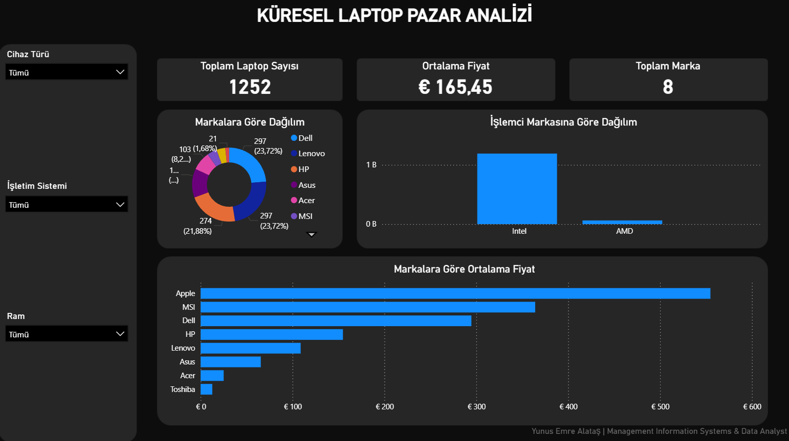

# 💻 Küresel Laptop Pazarı Analizi (Global Laptop Market Analysis)

Bu proje, dünya genelindeki dizüstü bilgisayar pazarını; donanım özelliklerinden fiyatlandırma stratejilerine kadar inceleyen **uçtan uca (end-to-end)** bir veri analizi çalışmasıdır.

## 🎯 Projenin Amacı
Pazardaki cihazların teknik donanımları (RAM, İşlemci, Disk tipi vb.) ile satış fiyatları arasındaki korelasyonu ortaya çıkarmak; marka bazlı pazar paylarını ve segmentasyonları veri odaklı analiz etmektir.

## 🛠️ Kullanılan Teknolojiler & Yetkinlikler
* **Veri Yönetimi & Ön İşleme:** Excel (CSV & XLSX)
* **Veri Analizi & SQL Sorgulama:** MS SQL Server (`CASE WHEN`, `Aggregation`, `Subqueries`, Veri Tipi Standardizasyonu)
* **Veri Görselleştirme:** Power BI (Interaktif Dashboard ve Raporlama)

## 📊 Proje Çıktısı (Dashboard Görünümü)
Verinin işlenmesi ve analiz edilmesi süreçlerinin ardından oluşturulan Power BI Dashboard'un genel görünümü aşağıdadır:

## 📂 Veri İşleme Süreçleri
1. **Veri Toplama (Raw Data):** Kaggle üzerinden alınan ham veri seti (`laptop_market_raw_data.csv`) depoya dahil edilmiştir.
2. **SQL ile Veri Temizleme & Dönüştürme:** Ham verideki karmaşık birimler (TB-GB dönüşümleri) ve sütun hataları SQL sorguları ile düzeltilerek analiz edilebilir hale getirilmiştir.
3. **Analiz & Görselleştirme:** Temizlenen veri seti Power BI'a aktarılarak, yöneticilerin karar alma süreçlerine yardımcı olacak kurumsal bir rapor panosu haline getirilmiştir.
